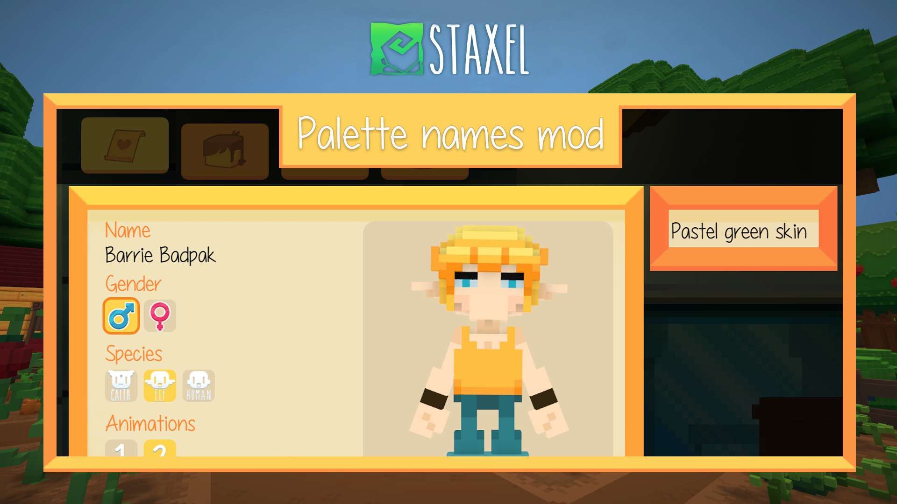

<h1 align="center">Staxel - Palette name tooltip mod</h1>

  
  

	

This mod is derived from Sunbeam and modifies the character creation UI slightly.
This mod adds a tooltip for the palettes, now when you hover over a palette color
it's name will be shown in the tooltip.

## Adding palette translations
In order to add translations for palette's create a .lang file as usual and make sure
that the translation key matches the palette's code from it's .palette file exactly.